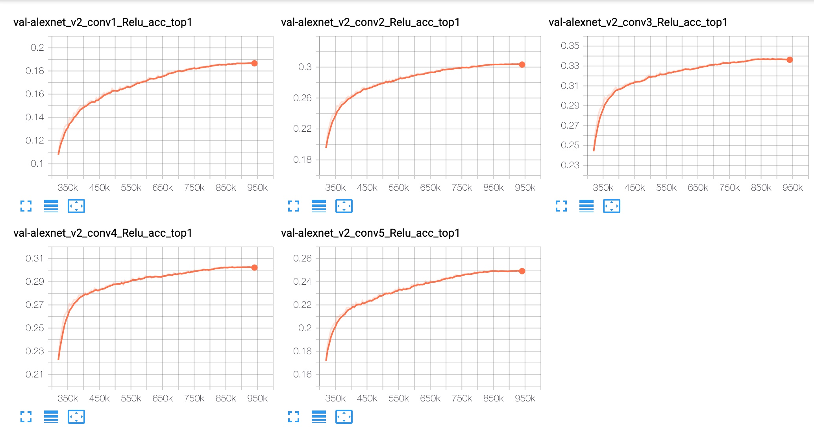

# tf_unsupervised_count
_Unofficial_ Tensorflow implementation of **Representation Learning by Learning to Count** 

### TL;DR

## Requirements

* Python 3+ [Tested on 3.6.10]
* Tensorflow 1.X [Tested on 1.14]
* TensorPack [Tested on 0.10.1]
* Nvidia-DALI [Tested on 0.20.0]
* Nvidia-DALI-Plugin [Tested on 0.20.0]

We use cuda 10.0.130 and cudnn v7.6.5

Our TensorFlow model and loss function are simple. However, to train it *efficiently*, we needed to use TensorPack and Nvidia-DALI libraries. If linking these libraries is challenging, feel free to remove them from the code and use Tensorflow only (e.g., tf.data.dataset). The requirements.txt lists all our install packages and their versions.

## ImageNet Pretrained Models

## Usage example

To run the unsupervised representation-count phase 

`python counter_trn.py --batch_size 256 --exp_name cnt_gpu4_bz256_adam_250 --net alexnet --learning_rate 0.0001 --gpu 0,1,2,3 --logits_dim 1000 --opt adam --epoch 250 --learning_rate_var_name lr_cnt --max_iters 1251`

To run the supervised linear-classifier phase

`python classifier_trn.py --exp_name cls_gpu2_bz256_adam_250 --pretrained --cnt_exp_name cnt_gpu4_bz256_adam_250 --batch_size 256 --learning_rate 0.001 --opt adam --epoch 250 --net alexnet  --learning_rate_var_nam lr_cls --gpu 0,1`

The following table compares our implementation with the paper results.

| ImageNet Performance          | conv1 | conv2 | conv3 | conv4 | conv5 |
|-------------------------------|-------|-------|-------|-------|-------|
| Mehdi et at. [1] \(Table. 2\) | 18.0  | 30.6  | 34.3  | 32.5  | 25.7  |
| Ours                          | 18.6  | 30.3  | 33.6  | 30.1  | 24.9  |
    
    
### TODO LIST

Contributor list
----------------
1. [Ahmed Taha](http://ahmed-taha.com/)
2. Alex Hanson

* We train the unsupervised representation-count phase for 250 epochs and the supervised linear-classifier phase for 250 epochs. This leads to a long training time. If someone has an to converge faster (e.g., a better learning rate scheduler), please share through a Github issue.  
* It would be great if someone re-implement this in PyTorch. Let me know and I will add a link to your PyTorch implementation here

### MISC Notes
* Our implementation is inspired by [CLVR's implementation](https://github.com/clvrai/Representation-Learning-by-Learning-to-Count). However, the CLVR's implementation has a serious bug and performance issues that need to be fixed. These issues are discussed [here](https://github.com/ahmdtaha/tf_unsupervised_count/blob/main/docs/clvr_bug.md).
* Our implementation diverges from the paper [1] technical details. We explain why this discrepancy is required [here](https://github.com/ahmdtaha/tf_unsupervised_count/blob/main/docs/paper_discrepancy.md).

## Release History
* 1.0.0
    * First commit on 25 Nov 2020

## References
[1] Representation Learning by Learning to Count
