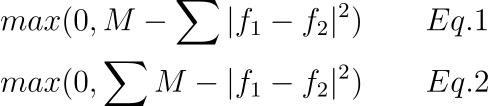

Our implementation is based on [CLVR's implementation](https://github.com/clvrai/Representation-Learning-by-Learning-to-Count). However, we found multiple issues with their implementation. We tried to reach Shao-Hua Sun over email and [github](https://github.com/clvrai/Representation-Learning-by-Learning-to-Count/issues/3) to discuss these issues, but recieved no reply.

In this document, we discuss a serious bug in CLVR's implementation. Then, we highlight other I/O and performance limitations. 

# Bug: Loss Function

The following image demostrates the loss function bug. The following two equations (Eq.1 and Eq.2) are different.
 

 
 Mehdi _et al._[1] employed Eq.1. This equation enforce that the feature should be different between two randomly chosen different images.
 Eq.1 computes the distance (_d \in R^1_) between two different features and make sure _d > M_.
 
 In contrast, Eq.2 d computes the distance **across every dimension** (_d \in R^d_) and make sure _d > M_ **for every dimension**,
  where _d_ in the dimension of the feature _f_..
 
 
Mehdi _et al._[1] proposed Eq.1. CLVR's repos uses [Eq.2](https://github.com/clvrai/Representation-Learning-by-Learning-to-Count/blob/2e86dfe22fabbbdaab18e858b835697b19f14b50/model.py#L67), while we use Eq.1. This fix is essential in order to converge.
 
 

# Issue: I/O

# Issue: Performance

# References
[1] Representation Learning by Learning to Count